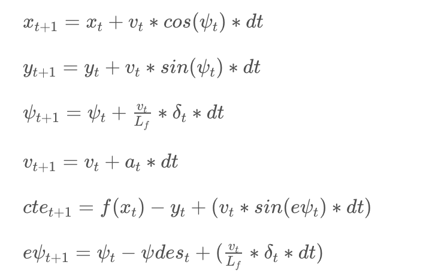

# CarND-Controls-MPC
Self-Driving Car Engineer Nanodegree Program

---

## The Model
The state of the model including:

* position (x, y)
* steering angle
* vehicle speed
* cross line error
* steering angle error

The model output two control variables: steering angle and gas. 

Equations to update the states:

## Timestep Length and Elapsed Duration (N & dt)

I first tried N = 10, dt = 0.05. In this config, parameters for cross line error and steer angle error have to be pretty small like 5 to 10 to keep the car drive without over-turning. 

Then I tried with N = 10, dt = 0.1. In this config, those two parameters could be set pretty large like the walk through video.

Because I still not so understand the math behind MPC, so I couldn't say why that happened.

## Polynomial Fitting and MPC Preprocessing

Changed the input car position from map coordinates to car coordinates.

## Model Predictive Control with Latency
I didn't do anything special about latency. According to the course forum, a dt larger then latency might be able to automatically handle the latency problem and I guess that's my case.

Another solution is when compute the new state, except compute by dt, compute the state after latency. 